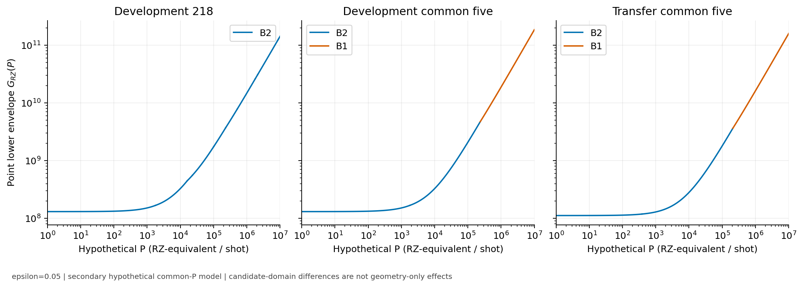

# Track A 原稿v0.1：補足・再現性付録

2026-10-05。[本文](track_a_resource_study_v0_1.md)のC1〜C6に対応する比較集合、追加metric、
不確かさ、出典identityと再表示手順をまとめる。新しい科学実行・独立再現の報告ではない。
元証拠のstatus・manifestを変更せず、原稿用asset manifestを別にする。

## S1 比較集合と台帳の意味

共通taskはlinear H4、STO-3G、保存DF rank12、8 system qubits、保存参照状態の
finite-time coherent signal、T=0.8。二次DF-prefix PF、canonical finite-RTE、対称軸shot規則を使う。
δ=T/q=0.8/0.4/0.2/0.1。費用は状態準備を除いた測定付きcontrolled full wrapper。
Qiskit1.3.0、rz/sx/x/cx、opt1、seed17、backend/coupling/layout/routing指定なし。

| domain / 登録元 | 構成数 | prefixと離散化 | 元ε=0.05の適格性 |
|---|---:|---|---:|
| development M1 B0 | 12 | L_D=3/6/9 × q=1/2/4/8、r=K=0 | 8 |
| development M1 B1 | 4 | L_D=12 × q=1/2/4/8、r=K=0 | 4 |
| development M1 B2 | 145 | L_D=3/6/9、登録q/r/Kの有限grid | 145 |
| development M1 B3 | 49 | L_D=0、登録q/r/Kの有限grid、one-body保持 | 49 |
| development PM-1 B0 | 8 | L_D=4/5 × q=1/2/4/8、r=K=0 | 8 |
| transfer fixed five | 5 | B2 L3 q1 r4/r8 K2、B0 L6 q1、B1 L12 q1、B3 L0 q8 r32 K4 | 5 |

developmentは1.00 Å、218構成中214適格。transferは1.30 Åの固定5構成だけである。
未登録r/Kの組を直積で補わない。保存fingerprint、axis bias、B、適格性、整数shots、6指標を残した
[元精度223行台帳](../../artifacts/resource_applicability/track_a_manuscript_v0_1/2026-10-05/original_precision_223_candidates.csv)
が完全なmachine-readable表示集合である。追加discardのPM1-B0-という元IDを保持する。

INELIGIBLEは登録済みだが現行shot規則に不適格、NOT_REGISTEREDは未評価構成、
MISSINGはその量が未保存である。いずれも0資源ではない。
M1の不適格4件にはcompile費用があるが、精度条件付きworkのfrontierには入れない。
B0のpure discard/PF errorは未分解で、総biasだけを用いる。

## S2 追加metricsと費用標本の不確かさ

### S2.1 元精度のdevelopment代表

下表は本文図1の4件、ε=0.05、P=0でのshot-weighted値を丸めたもの。
6指標は異なる費用proxyでありprimaryはRZ countだけ。図と台帳には丸め前の保存値を使う。

| 構成 | RZ count | RZ depth | CX count | CX depth | total depth | circuit size |
|---|---:|---:|---:|---:|---:|---:|
| B0 L5 q1 | 229,718,060 | 102,707,240 | 130,897,320 | 110,765,250 | 223,732,850 | 437,723,540 |
| B1 L12 q1 | 372,523,128 | 163,283,640 | 214,780,788 | 182,475,009 | 362,456,433 | 711,964,695 |
| B2 L3 q1 r4 K2 | 130,774,896.656 | 53,615,452.125 | 69,446,391.750 | 55,950,637.813 | 116,808,764.094 | 249,472,886.375 |
| B3 L0 q8 r32 K4 | 1,152,790,918 | 264,139,332 | 380,595,882 | 177,002,696 | 580,269,462 | 2,237,002,806 |

この4件だけを全Pareto集合とはしない。全218＋5の6指標はS1の台帳を参照する。
元標本・近接baselineの正本は[M1-B1照合](../pr2_matched_accuracy_m1_b1_result_validation.md)と
[PM-1照合](../pr2_pm1_discard_result_validation.md)である。

### S2.2 Paired-axis SEとratio

random構成ではm=32のtrajectoryごとに同じevolutionからcosine/sine wrapperを作る。
固定した解析shot重みを用いて

$$
Y_{x,i}=N_{x,\mathrm{real}}C_{x,\mathrm{cos},i}
       +N_{x,\mathrm{imag}}C_{x,\mathrm{sin},i},\qquad
\mathrm{SE}_x=\frac{s(Y_x)}{\sqrt{32}}
$$

とする。sは標本標準偏差。すなわち

$$
\mathrm{SE}_x^2=\frac{
N_{\mathrm{real}}^2s_{\mathrm{cos}}^2+
N_{\mathrm{imag}}^2s_{\mathrm{sin}}^2+
2N_{\mathrm{real}}N_{\mathrm{imag}}s_{\mathrm{cos},\mathrm{sin}}
}{32}.
$$

paired covarianceを消さない。Pは決定論的共通加算なので、このsampling SEは変えない。
Nは保存bias/Bに条件付けた規則上の値で、その誤差・compiler変更・構成選択の不確かさは
上のSEに含めない。B0/B1のsampling SEは0。

独立candidateのratio ρ=G_x/G_yには

$$
\mathrm{SE}_\rho\simeq\sqrt{
\frac{\mathrm{SE}_x^2}{G_y^2}
+\frac{G_x^2\mathrm{SE}_y^2}{G_y^4}} .
$$

点±2SEはengineering intervalでありformal CI、family同時区間、厳密winner認証ではない。
元M2のmin B2/min endpointは0.5860898125、区間[0.5785955111,0.5935841140]。
endpointはdeterministic B0でSE=0。これは元ε=0.05の固定5構成内の判定量である。

### S2.3 Precision感度の対応

保存301対数点＋0.05の302点は同じbias/Bと元cost標本の再利用である。
図2の[method別表示台帳](../../artifacts/resource_applicability/track_a_manuscript_v0_1/2026-10-05/figure_2_method_minima.csv)と
[302行点最小設定台帳](../../artifacts/resource_applicability/track_a_manuscript_v0_1/2026-10-05/figure_2_point_minimum_settings.csv)
には選んだ元candidate fingerprintを残す。新しい統計検定・精度点・連続根探索はない。
全302点で別候補のengineering区間が重なるという監査を、全method同等の証拠にしない。
元精度再現と全数値照合の正本は[PM-2照合](../pr2_pm2_precision_resource_result_validation.md)である。
巨大shot boundのceilはbinary64の固定演算順に依存し、任意精度の厳密最少shot数ではない。

## S3 同domain比較、selector監査、欠測の保持

[PM-0帰属報告](../research/pr2_post_m2_evidence_attribution.md)に基づく。
旧S2からM1への変更にはcandidate domain等の複数変更がある。qだけへ因果帰属しない。

| 同じM1 domain | 登録 / 適格 | primary点最小 | G_RZ、ε=0.05、P=0 |
|---|---:|---|---:|
| q=8部分集合 | 53 / 52 | B2 L3 q8 r2 K2 | 684,061,479.375 |
| 可変q全M1 | 210 / 206 | B2 L3 q1 r4 K2 | 130,774,896.65625 |

両方B2であり、可変qはprimary点値を約80.88%下げるがmethodの逆転ではない。
旧16-cell random selectorはprimary最小を保持したが、6指標point Paretoの2件中1件を失った。
旧SELECTION_LIMITEDは「proxyで安全に候補圧縮できなかった」という監査として保持する。

| metric | 旧16-cell selectorのpoint regret |
|---|---:|
| RZ count（primary） | 0% |
| RZ depth | 約1.21758% |
| CX count | 約0.68132% |
| CX depth | 約2.25535% |
| total depth | 約1.19953% |
| circuit size | 0% |

64件proxy frontierは元2件Paretoを保持するが、proxy-dominated構成のactual dominationを証明したわけではない。
same-Rは56 groupの保存結果で、図4は既存説明のL_D3、K2、T0.8、R8の一組だけ。
新たに有利なgroupを探索せず、random action期待値をcompiled gate数と呼ばない。
det/random/basis別compiled RZ、B0 pure discard/PF errorの欠測成分を埋めない。
q依存biasの非単調性を誤差相殺機構の実証にしない。

## S4 共通状態準備費用のsecondary感度

共通仮想P≥0をRZ-equivalent/shotとして足す。
保存されたaffine segment G_x(P)=G_x(0)+N_total Pのpoint lower envelopeを表示する。
実準備回路compile、physical FT換算、candidate別準備費用ではない。

図S1．ε=0.05、linear H4、STO-3G、DF rank12、T=0.8、保存状態、二次PF、
canonical finite-RTE、対称軸shot規則。左は1.00 Å development218、中央は同geometryの
M2共通5構成、右は1.30 Å元M2固定5構成。各δはT/q。
保存segmentを描画するために評価し、envelope・交点を探索し直していない。
log表示はP=1〜10^7。P=0は本文・元精度台帳で示す。
point envelopeであり、MC uncertaintyを加えたrobust winner領域ではない。

| 共通5構成 | P=0の点最小 | r4→r8交点 | r8→B1交点 |
|---|---|---:|---:|
| development 1.00 Å | B2 L3 q1 r4 K2 | 1,796.42321345 | 235,578.460523 |
| transfer 1.30 Å | B2 L3 q1 r4 K2 | 385.077613198 | 208,735.131712 |

development218ではB2だけがenvelopeを構成するが、共通5構成では両geometryとも大PでB1が入る。
候補集合の異なる感度差をgeometryだけへ帰属せず、仮想Pを実測準備費用と読まない。

## S5 Evidence chainとidentity

### S5.1 科学実行とPOSTHOCの区別

| stage | 役割 | 既存scope / audit |
|---|---|---|
| M1-A | signal・bias・B・shotsの元登録 | 210候補、206適格、compile0、SELECTION_LIMITED |
| M1-B1 | actual compiled cost | 210 cell、12,448 wrapper records、12,128 transpile＋320 same-candidate reuse、random各32 trajectories |
| M2 | 結果前固定5構成の一回transfer | 196 wrappers、random3×32 trajectories、CPU最大5、wall971.824秒、元TRANSFER_SUPPORTED |
| PM-0 | domain・selector・same-R帰属訂正 | POSTHOC、18 local tests、科学計算0 |
| PM-1 | 近接discard反証 | 8 signals、16 deterministic wrappers、CPU1、wall141.614秒、pre/post201 local tests |
| PM-2 | 保存値precision/P感度 | 302点、67,346行、CPU1、wall2.921秒、pre/post62 local tests、科学計算0 |
| 今回 | 原稿化・再表示 | 主図4・補足図1、表示CSV6、新signal/sampling/compile0 |

元M2のpre/postはfocused84・helper134、fail/skip0。
これらは保存された各stageの監査数で、今回科学testsを再実行したものではない。
local evidenceをimmutable CI、外部再現、実量子shot実験と呼ばない。

| 対象 | commit |
|---|---|
| M1-A結果 | 3c1831e326c27c5f679b3820997f27916d26ed9f |
| M1-B1 source / evidence | 33f436bb3a7d5b9cefa23604bb22c8d1fb17cd62 / 8e0814e70c14ecf526444fac8a2142799610dc96 |
| M2 source / launch | 2978e2fea672b7a1ff20cac74269ec9a610159dc / 40a11d02a67954175686b2e532b83c7953ec8316 |
| PM-1 source / launch | fd7552edc0334ccf57ecf501a128c85c8d22822a / ab6f0bbe908e28b2ddf90550cd485db7fce89e39 |
| PM-0入力commit | b6e65c6123475add5e620ec1064f361378bead95 |
| PM-2四入力commit | 194cc604b90c56a0e7e949b91b064a4bcfc846da |
| PM-2 source / launch | 324435d77b6642dbd44e8d1f178420daf62e77ed / bea4cf00f08e28b2ddf90550cd485db7fce89e39 |
| 原稿の結果収録commit | 5a1adffad780f0ec4272f5e8bb94713f9ff0f2bc |
| 原稿設計commit | d45c4006d440ba053517d6f646844a61b18dfd15 |

元科学JSONを以下に示す。figure builderは次節の9件だけを読む。

| 結果 | SHA-256 |
|---|---|
| [M1-A](../../artifacts/pr2_matched_accuracy_m1_execution/2026-09-30/pr2_matched_accuracy_m1_a_result_v1.json) | 1f960d7a33296e2dcb74d497e360572b26409dc9aeae01522335e7b91ed81086 |
| [M1-B1](../../artifacts/pr2_matched_accuracy_m1_b1_execution/2026-09-30/pr2_matched_accuracy_m1_b1_compile_map_result_v2.json) | 71278113c32b26af0dbf6144a626237a0087478212f8a93fc908de3d4d52aee4 |
| [M2](../../artifacts/pr2_matched_accuracy_m2_transfer_execution/2026-10-04/pr2_matched_accuracy_m2_transfer_result_v2.json) | f41a92beb57e59cddc8c063b061c40acd4da50cb76ac0698efc2bce004937931 |
| [PM-1](../../artifacts/resource_applicability/pr2_pm1_discard_execution/2026-10-04/result.json) | 9305857873602d6bc4f45fbc78c4903911d083156620df01e9b23f00e7fdf05b |

M2 result fingerprint：d9003ac6e32b2888d69aa1fed226dbef48cf13e1a6f10829e137c136824bb320。
詳細は元plan/authorization/resultへ遡る。原稿作成時点は未commitで、作業treeに別作業の変更もある。
利用者の指示で原稿bundleのみを別commitへ収録し、公開handoffに確定commitを示す。
元commit済み科学結果と原稿の公開commitを区別し、公開を独立再現・immutable CIとは呼ばない。

### S5.2 図生成の明示allowlist

9入力を結果収録commitのblobとbyte-identical・SHA一致と確認してから描画し、描画後も照合した。
PM2はartifacts/resource_applicability/pr2_pm2_precision_analysis/2026-10-05/、
PM0はartifacts/resource_applicability/pr2_post_m2_evidence_attribution/2026-10-04/を表す。

| 入力 | SHA-256 |
|---|---|
| PM2 precision_ledger.csv | ed4ff1f9192f18b9dd3cd700b84a49d525bbd7e78f464c85ea57559702a51749 |
| PM2 representative_decomposition.csv | 8900b769b6a3211833ffd32c1e7e8d1be057c852c2e98a7f8bd3453fe5f60839 |
| PM2 eligibility_boundaries.csv | d6b45e88fa60238091d3c514e9aada98a907a1b4a07ed306e6e0411a78826882 |
| PM2 P_envelope.csv | 3eb0791687c1fbe7c56bbfde99fba4256071aac126ad0ef90ae415b6831c1a8c |
| PM2 summary.json | 7b026d4cc657cf43ad23fd7d6e10d5aa31cd58af555649b7a8e858ea12155845 |
| PM2 manifest.json | 546cdfaf8c77f349f6f55b346e93749ce5956c9a605281d169887257377c843f |
| PM2 claim_audit.json | 3ca528aa8061bcf45a63ffeb58f41e722b097fa05b27370889859eb44ba7fecd |
| PM0 same_R_candidate_comparison.csv | 0e202cc7c913d06f4124b671780eba8245f33f4343739f87bc1f1f33cb9d65e5 |
| PM0 summary.json | 182d525116a10cda335f696a89d58204f989b3075fd06a3c303677d9f861a313 |

分子snapshot、exact state、pickle、runtime/checkpoint/cache/registryへアクセスせず、
科学module、sampler、Qiskit、GPUをfigure builderにimportしていない。
明示program・操作の監査であり、OS sandboxによる全アクセス証明ではない。

## S6 原稿・図の再表示

[figure builder](../../scripts/resource_applicability/build_track_a_manuscript_figures.py)は
stdlibとNumPy/Matplotlibを使う。Python3.11.0rc1、Matplotlib3.9.2、install/環境変更なし。
rootから未使用の新規outputを指定する。既存directoryは拒否し上書きしない。

    PYTHONNOUSERSITE=1 PYTHONDONTWRITEBYTECODE=1 \
    OPENBLAS_NUM_THREADS=1 OMP_NUM_THREADS=1 MKL_NUM_THREADS=1 \
    "/home/abe/Project/Partially Randomized Trotter/.venv311/bin/python" \
      scripts/resource_applicability/build_track_a_manuscript_figures.py \
      --project-root "$PWD" \
      --output-dir /tmp/track-a-manuscript-new-render

この/tmp pathも既存なら別の未使用pathを選ぶ。
科学runの再実行ではなく、保存CSVの選択・整形・描画である。
環境差でも画像がbyte-identicalとなる保証はなく、入力・source・生成manifestで追跡する。
PNGは閲覧用、SVG/PDFはvector版。

[asset manifest](../../artifacts/resource_applicability/track_a_manuscript_v0_1/2026-10-05/manifest.json)
は生成22ファイルのbytes/SHAを記録し、
[display audit](../../artifacts/resource_applicability/track_a_manuscript_v0_1/2026-10-05/display_audit.json)
は9入力、source hash、Python/Matplotlib、domain、科学計算0を記録する。
旧runner manifest・global validation manifestには原稿を科学的証拠として追記しない。

[専用表示tests](../../tests/tracks/resource_applicability/test_manuscript_figures.py)は合成値・一時file・sourceだけを使う。
原稿bundle identityと検査結果は
[verification audit](../../artifacts/resource_applicability/track_a_manuscript_audit/2026-10-05/verification.json)、
人による文章監査は[claim audit](track_a_resource_study_claim_audit_v0_1.md)へ分離する。

## S7 次のreviewとSTOP

独立resource paperとして十分か、technical/resource noteで閉じるべきかは未確定。
最も近いGüntherらとの重なり、強いcontrolled synthesis baseline未評価の影響、機構説明の強さを
完成原稿で別reviewへ戻す。原稿執筆者の監査を独立した投稿可能性reviewとは呼ばない。

新signal/trajectory/compile/分子計算/量子shot/GPUは0。
PM-3、追加96、strong synthesis、高次PF、別geometry/分子、energy/RPE総cost、Track B統合は未認可。
原稿完成を理由に追加実行しない。追加計算は別判断・別認可とする。
