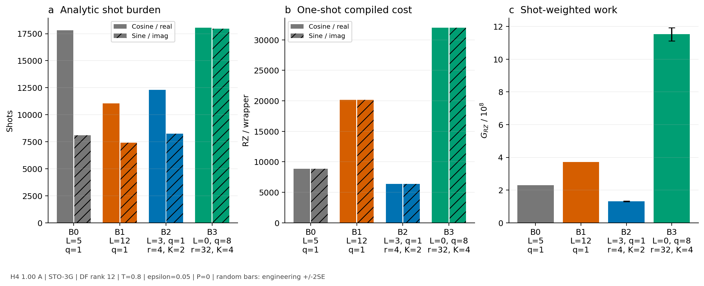
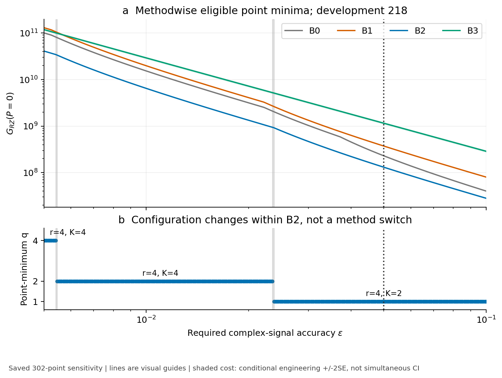
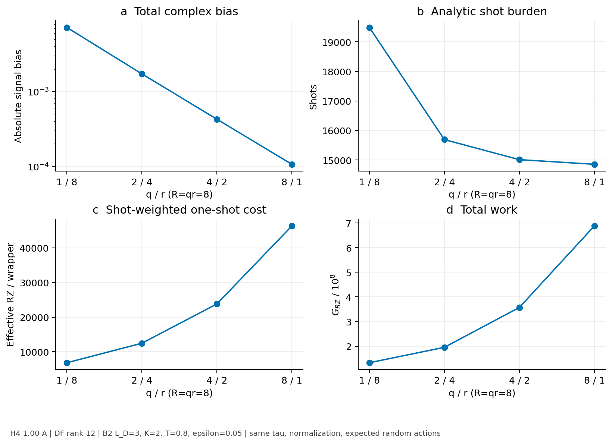
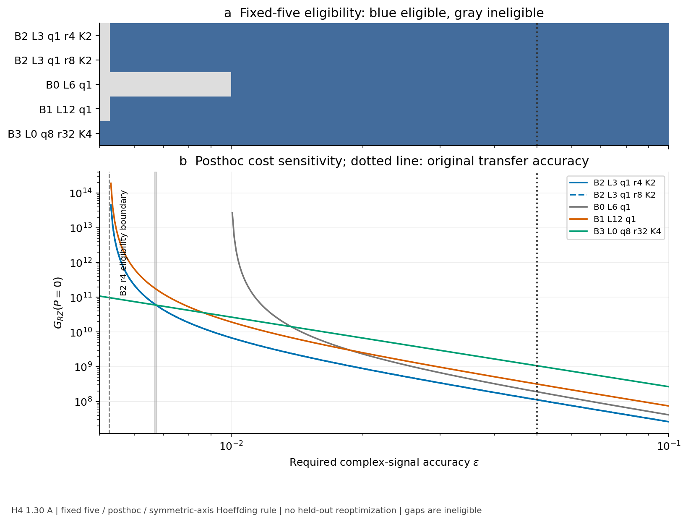

# DF-prefix時間発展における精度条件付き資源比較

残差切断・ランダム補完・固定構成移送の事例研究

Accuracy-conditioned resource trade-offs in DF-prefix coherent-signal estimation:
a case study of truncation, randomized completion, and frozen-configuration transfer

日本語通し原稿 v0.1、2026-10-05。著者・所属・投稿先は未確定。
本稿は保存済みlocal evidenceを用いた原稿であり、新しい科学計算を報告するものではない。
[補足・再現性付録](track_a_resource_study_supplement_v0_1.md)と
[claim audit](track_a_resource_study_claim_audit_v0_1.md)を併せて読む。

## Abstract

時間発展の近似が要求精度を満たすことと、測定を含む資源が小さいことは同じではない。
本稿では、固定したdouble-factorized（DF）Hamiltonianに対する残差の切断、全決定論的保持、
部分ランダム化、random-dominant実装を、同一の有限時間complex-signal精度で比較する。
対象はlinear H4、STO-3G、DF rank12、8 system qubits、保存参照状態、T=0.8であり、
二次DF-prefix積公式とcanonical finite randomized Taylor expansionを用いる。
1.00 Åのdevelopmentで登録した218構成を、対称軸配分の十分shot規則と状態準備を除いた
測定付きfull-wrapperのcompiled RZ費用で評価した。
ε=0.05では、近接discardのL_D=4/5を追加しても、B2 L_D=3,q=1,r=4,K=2のprimary点推定は
最良の登録discard構成より43.07%低かった。保存値によるε=0.005〜0.1の感度では、
全表示点のprimary点最小methodはB2のまま、内部設定がq=4、2、1へ変化した。
developmentから固定した5構成の1.30 Åへの元精度での移送は支持されたが、
使用済みデータの事後精度感度では、厳しい側で移したB2構成が現行shot規則に不適格となった。
これらは登録集合・状態・compiler・受理規則に条件付けた結果である。
厳密な最適構成、新algorithm、一般的なmethod優位、energy/QPE/RPE全体の最終総資源は主張しない。

## 1 Introduction

Hamiltonian simulationを用いた量子計算では、近似誤差を減らす回路が必ずしも最も安い推定を与えない。
ランダム化により一回の回路を軽くできても、信号のnormalization補正や残るbiasによって測定負担が増える。
一方、弱いHamiltonian項を単純に捨てる実装は回路が短くても、biasが統計誤差の余裕を消費する。
比較すべきなのは近似誤差または回路単体の費用だけでなく、同じ推定taskに必要なshot数と回路費用の積である。

この考え方やpartial randomization自体は既知である。Güntherらは、決定論項とランダム項を分けた時間発展を
single-ancilla phase estimationへ接続し、化学系の資源評価を行っている。
同論文のfactorized Hamiltonianの議論はDF項の部分保持を扱い、truncationとの比較も含む。
したがって、DFへの適用、discardとの比較、測定負担の考慮だけを本稿の新規性にはしない。
[Güntherら](https://arxiv.org/abs/2503.05647v2)、[Sec. VII・Appendix D.2](https://arxiv.org/pdf/2503.05647v2)。

関連する設計空間も広い。Hagan–WiebeのComposite Quantum SimulationsはTrotter–SuzukiとQDriftの
分割を扱い、CasaresらのSPRINT/GRADEは化学Hamiltonianのrandomization・factorizationを含む設計を扱う。
OumarouらのRC-DFは圧縮・正則化によって表現そのものを改善する。
本稿はこれらへの一般的優位を試すのではなく、DF表現と二次実装classを固定して残差処理を比較する。
[Hagan–Wiebe](https://arxiv.org/abs/2206.06409v3)、[Casaresら](https://arxiv.org/abs/2606.30741v1)、
[Oumarouら](https://arxiv.org/abs/2212.07957v3)。

さらにKanasugiらはpartial randomizationを用いた化学系のend-to-end QPE資源を評価し、
Cuginiらは回路費用とestimator varianceを共同で考慮するimportance samplingを提案している。
本稿はcanonical sampling distributionを変更せず、finite-time signalを所定精度で推定する費用を調べる。
physical fault-tolerant resource estimateやresource-optimal samplingを提示する研究ではない。
[Kanasugiら](https://arxiv.org/abs/2603.22778v2)、[Cuginiら](https://arxiv.org/abs/2603.13495v1)。

本稿が答える限定的な問いは、固定DF表現・二次積公式・有限cutoff・shot規則の下で、
残差処理の資源競争力をbias、normalization、測定負担、実際のfull-wrapper compileからどう説明できるかである。
中心となる証拠は、近接discard baselineを補ったdevelopment比較、登録構成の精度依存、
結果前に固定した少数構成の別geometryへの移送である。成功例を増やすために比較集合を追加することはしない。

## 2 Task and methods

### 2.1 固定Hamiltonianと推定対象

推定対象は、各geometryで保存したHamiltonian Hと参照状態 |ψ⟩による

$$
z(T)=\langle\psi|e^{-iHT}|\psi\rangle
$$

の実部・虚部である。full-H targetは保存値を用いる。参照状態へのアクセスを仮定し、
状態準備回路の費用はprimaryから除く。biasをfull-H参照と照合するbenchmarkであり、
未知のtruthを使わずに運用できるselectorやcertified ground stateの取得法を提案するものではない。

| 項目 | 固定条件 |
|---|---|
| 分子・basis | linear H4、STO-3G、8 system qubits |
| development / transfer | 隣接距離1.00 Å / 1.30 Å |
| Hamiltonian表現 | 各geometryの保存DF rank12・固定fragment列 |
| 時間・積公式 | T=0.8（atomic units）、二次DF-prefix PF |
| 外側離散化 | q=1,2,4,8、δ=T/q=0.8,0.4,0.2,0.1 |
| 失敗確率配分 | α_real=α_imag=0.025 |
| compiler | Qiskit1.3.0、opt1、rz/sx/x/cx、seed17、topology指定なし |
| 費用scope | 状態準備なしの測定付きHadamard full wrapper |

DF rank12はHamiltonian表現のrankであり、prefix長L_Dとは異なる。
Hをone-body correctionと固定順のDF二体fragmentに分け、先頭L_D fragmentを決定論側に置く。
B0は残りをdiscardし、B1は全12 fragmentを決定論的に保持する。
B2は中間prefixを保持して残差をcanonical finite-RTEで補完する。
B3は二体prefixを0とするrandom-dominant endpointであるが、one-body項は保持するため完全なall-randomではない。

二次partial stepは、決定論fragmentのforward/reverse half sweepと中央の残差evolutionからなる。
残差は各stepのr short steps、有限Taylor cutoff Kで実装し、q stepを連結する。
以下ではx=(method,L_D,q,r,K)を一つの構成と呼ぶ。step/occurrenceごとの独立samplingとcontrolled phaseを
含む既存実装を固定し、cosine/sineは同じrandom evolutionを共有する。
比較中にfactorization、fragment順、sampling distribution、compile policyを変更しない。

残差のidentity phaseを別に保持した後、random成分を
\(H_R=\lambda_R\sum_\ell p_\ell P_\ell\)、
\(p_\ell=|c_\ell|/\lambda_R\)、\(\lambda_R=\sum_\ell|c_\ell|\)と書く。
符号を吸収した\(P_\ell\)はHermitian involutionで、固定DF成分から得る。
物理short-step時間は\(\Delta_R=T/(qr)\)、
無次元時間は\(\tau=\lambda_R\Delta_R\)であり、両者を区別する。

canonical paired-Taylor分布では、偶数order \(n=0,2,\ldots,K\)の重みを

$$
w_n(\tau)=\frac{|\tau|^n}{n!}
\sqrt{1+\left(\frac{\tau}{n+1}\right)^2},
\qquad
\beta_K(\tau)=\sum_{n=0,2,\ldots,K}w_n(\tau)
$$

とし、orderを\(w_n/\beta_K\)、成分を\(p_\ell\)から独立にsampleする。
各eventはn個のproductと一つのrotation、必要なcontrolled phaseを持つ。
Kはpaired orderのcutoffで、補正後Taylor polynomialは通常のdegree K+1までを含む。
この固定q/r/K構成の総normalizationは\(B_x=\beta_K(\tau)^{qr}\)であり、
有限分布の積を使う。無限cutoffの式や上界を実際のBへ代入しない。
これは既存canonical implementationの定義で、新しいsampling法ではない。
[sourceの定義](../../src/trotterlib/rte.py)、
[元signalの定義](../../src/trotterlib/pr2_matched_accuracy_m1_execution.py)に従う。

実装・候補登録の完全な所在は[補足S1・S5](track_a_resource_study_supplement_v0_1.md)に示す。

### 2.2 Bias、normalization、十分shot数

構成xのnormalizationをB_x≥1とし、physical measured signalの平均をB_xで補正した
complex signalを\(\widetilde z_x\)とする。a∈{real,imag}に対して
\(b_{x,a}=|\widetilde z_{x,a}-z_a|\)を用いる。
B0/B1ではB_x=1である。biasは保存された総biasであり、B0のpure discard/PF成分を補間・分解しない。

要求するcomplex-signal精度をεとし、各軸へe=ε/√2を配分する。
全軸で残る統計headroom \(s_{x,a}=e-b_{x,a}>0\)を満たす構成だけをaccuracy-eligibleとする。
採用したHoeffding十分shot規則は

$$
N_{x,a}(\epsilon)=\left\lceil
\frac{2B_x^2\log(2/\alpha_a)}{s_{x,a}^2}
\right\rceil .
\tag{1}
$$

補正後の一標本の値域を±B_xとする規則であり、biasと統計誤差を別に配分する。
Nは解析上の十分shot数で、実行した量子shot数ではない。
α_axisは個々のsignal taskの配分であり、候補集合全体のwinnerを保証しない。

この規則のstrict適格境界は
\(\epsilon_{\min,x}=\sqrt2\max_a b_{x,a}\)である。
ε=ε_minの等号は不適格とする。これは対称軸配分と採用した十分shot規則に依存する境界で、
原理的なprecision limitではない。別の軸配分や推定器の費用は今回評価しない。

### 2.3 測定込みcompiled workと不確かさ

軸aの状態準備なしfull-wrapper平均compiled RZ数を\(\overline C_{x,a}\)とし、primaryを

$$
G_{x,RZ}(\epsilon,P)=\sum_a N_{x,a}(\epsilon)(\overline C_{x,a}+P)
\tag{2}
$$

とする。本文はP=0、P≥0は共通の仮想RZ-equivalent準備費用/shotとして補足で扱う。
RZ countは物理runtime、T countまたはfault-tolerant総資源ではない。
secondaryにはRZ depth、CX count、CX depth、total depth、circuit sizeを同じshot重みで保存する。
6指標のpoint Paretoとprimary点最小は別の判定量である。

random構成の平均費用は元32 trajectoriesから得る。
各trajectoryでcosine/sine費用を対応付け、shot-weighted sumのSEに軸間covarianceを保持する。
点±2SEはengineering intervalで、formal CIでも候補全体に対する同時区間でもない。
構成選択後の条件付きSEを、選択手順全体の不確かさと呼ばない。
決定論構成のSE=0はsampling変動がないことを表し、compiler依存性やmodel不確かさがないという意味ではない。

### 2.4 比較domainと事前固定・事後解析の区別

developmentは元210構成と近接discard8構成の計218件で、L_D=0,3,4,5,6,9,12、q=1,2,4,8の
登録された組だけを含む。random194構成は各32 trajectoriesの費用を持つ。
近接discard8件はL_D=4/5 × q=1/2/4/8、r=K=0である。
元ε=0.05では214/218件が適格で、不適格4件も台帳から消さない。
これは全prefix・全r/K・全合成法の網羅探索ではない。

transferはdevelopmentから結果前に固定したB2二件、B0/B1/B3各一件の5構成だけを1.30 Åで評価する。
その後の精度感度では、保存bias、B、軸別費用を使い、ε=0.005〜0.1の301対数点と正確な0.05、
計302点を再表示する。developmentとtransferは別集合を維持する。
同じbiasと元cost標本を使い回す事後感度であり、302回の独立実験または新しいheld-out試験ではない。
線は隣接表示点を結ぶvisual guideに限り、連続εの厳密な切替根を求めない。

## 3 Development comparison

ε=0.05、P=0で各methodのprimary点最小代表を図1に示す。
B2 L_D=3,q=1,r=4,K=2は20,563 shotsを要し、B1の18,471より測定負担が大きい。
しかし一軸の平均compiled RZは6,359.71875で、B1の20,168より小さく、G_RZは
1.30774897×10^8対3.72523128×10^8となる。
shot数が最少の構成と、測定込みcompiled workが最少の構成は一致しない。
[保存値照合](../pr2_pm2_precision_resource_result_validation.md)。

図1．H4 linear 1.00 Å、STO-3G、DF rank12、T=0.8、ε=0.05、P=0。
左から解析軸別shots、軸別1-shot RZ、shot-weighted primary work。
表示構成はB0 L_D5 q1、B1 L_D12 q1、B2 L_D3 q1 r4 K2、B3 L_D0 q8 r32 K4。
δは前3件0.8、B3は0.1。random error barsは元32 paired cost標本の±2SEでformal CIではない。
この4件の軸別平均RZは一致するが、解析・描画は軸別値を保持する。状態準備・量子shot実行は含まない。

元のdiscard gridにはL_D=3と6の間に穴があった。近接L_D=4/5を明示的に評価すると、
8構成はいずれもε=0.05に適格となったが、安い回路が低いGを保証しなかった。
例えばL_D=4,q=1は109,738 shots、G=7.84187748×10^8を要する。
追加後のB0点最小はL_D=5,q=1で、25,910 shots、平均RZ8,866、G=2.29718060×10^8となる。
旧L_D=6,q=1より9.34%低いが、B2のprimary点推定はこの改善されたdiscard値より43.07%低い。
[近接discard結果](../pr2_pm1_discard_result_validation.md)。

したがって、登録discard gridの近傍を補うだけでは観測されたB2の低いprimary点推定は消えなかった。
ただし未登録prefix、高次PF、強いcontrolled synthesis、別factorizationを含む全決定論法への優位を示したわけではない。
r/Kを含むB2内部の厳密winnerも認定しない。
本比較が示すのは、この固定実装class・task内で回路単体の短さと精度余裕の両方を数える必要である。

## 4 Precision dependence and resource competition

### 4.1 設定は変わるが点最小methodは変わらない

図2は全218構成から保存したmethod別eligible primary点最小を示す。
固定302表示点では点最小methodはB2のまま、L_D=3内部の設定が厳しい精度側から
q4 r4 K4、q2 r4 K4、q1 r4 K2へ変わる。
q4の最後の点はε=0.0054158189504、q2の最初は0.00547017101788であり、
q2の最後0.0235054643684からq1の最初0.0237413604716へ切り替わる。
これらは隣接表示点による区間で、連続εの正確なcrossoverではない。
[精度ledgerと照合](../pr2_pm2_precision_resource_result_validation.md)。

図2．H4 1.00 Å、STO-3G、DF rank12、T=0.8、二次PF、δ=T/q、登録218構成。
(a) eligibleなmethod別primary点最小、(b) 全構成の点最小に属するq。
色付き費用帯は表示構成に条件付けたengineering ±2SEで、family同時CIではない。
灰色の細帯は隣接表示点間の設定切替、点線は元ε=0.05。線はvisual guide。
同じ保存bias・normalization・32 cost標本のPOSTHOC感度で、302回の独立検証ではない。

ここで見えるのはmethodの逆転ではなく、B2 family内で精度に応じた離散化設定の変更である。
保存解析では全302点で点最小と別候補のengineering intervalが重なる。
これは近接B2設定を厳密に順位付けできないことを含むが、全点でB2と全endpointが区別不能だという意味ではない。
図の点最小を統計的winnerとして読むことも、区間重なりをmethod同等性として読むことも避ける。

bias、normalization、費用の競合は式(1)から直接説明できる。
\(h_{x,a}=s_{x,a}/(\epsilon/\sqrt2)\)と置き、ceilを省いた説明式では

$$
G_x^*(\epsilon,P)=\frac{4\log(2/\alpha_a)}{\epsilon^2}
B_x^2\sum_a\frac{\overline C_{x,a}+P}{h_{x,a}^2} .
\tag{3}
$$

ここでは両軸のαが等しい。これは十分shot式の代数的整理で、新しい理論ではない。
B_x^2の増加、headroom減少、回路費用増加はそれぞれGを押し上げる。
正式な図と台帳はceilを含む保存整数shotを使い、式(3)で置き換えていない。

discardでもqを増やせば総biasが必ず減るわけではない。
B0 L_D5の現行適格境界はq1で0.0186305147953、q2/4/8で
0.0264386154414、0.0282755427931、0.0287279977061となる。
この非単調性は保存値の観測であるが、pure discard/PF成分は欠測であり、誤差相殺の機構を実証したとはしない。

### 4.2 同じrandom負担でもqの費用効果が競合する

図4は、既存比較のうちB2 L_D=3,K=2,T=0.8,R=qr=8の一組に固定する。
q/r=1/8、2/4、4/2、8/1では無次元short-step時間τ、normalization、random action期待値が同じである。
この組ではqの増加により総complex biasが約0.00725187から0.000106825へ減り、
shotsも19,489から14,858へ減る。一方、shot-weighted 1-shot RZは約6,809から46,333へ増え、
Gは1.32704255×10^8から6.88410607×10^8へ増える。
同じrandom負担を揃えても、bias改善が増えたfull-wrapper費用を補うとは限らない。
[保存same-R比較](../research/pr2_post_m2_evidence_attribution.md)。

図4．H4 1.00 Å、STO-3G、DF rank12、B2 L_D3、K2、T=0.8、ε=0.05、P=0、R=8。
各点のδは0.8/0.4/0.2/0.1。(a) 総complex bias、(b) 解析shots、(c) shot-weighted effective 1-shot RZ、
(d) primary work。τ、normalization、random action期待値は同一。
この組の説明例であり、q一般の単調則や未保存のdet/random/basis別compiled費用分解ではない。
図番号はdevelopment precisionを図2、transferを図3、same-Rを図4とする固定設計に従う。

## 5 Frozen-configuration transfer

### 5.1 元精度での結果前固定transfer

developmentの6指標point Paretoに残ったB2 L_D3 q1 r4/r8 K2と、
B0 L_D6 q1、B1 L_D12 q1、B3 L_D0 q8 r32 K4の計5構成を結果前に固定し、H4 1.30 Åへ移した。
ε=0.05では全5件がaccuracy-eligibleで、重大primary cost underestimateのないB2二件がpoint Paretoに残った。
重大underestimateは、held-out shots×development軸別費用の予測をactual primaryが厳密に10%超上回る場合とした。
accuracy-eligibleかつ非重大underestimateのB2だけをsupportの証人とした。

最小B2のG_RZは111,753,794.4375、最小endpoint B0は190,676,910であり、比は0.5860898125となる。
independent-candidate delta methodのengineering ±2SEは[0.5785955111,0.5935841140]で、
事前固定したupper≤1.10の条件も満たした。元のterminal判定はTRANSFER_SUPPORTEDである。
B2 r4/r8のprimary点差は約0.358%と小さく、厳密winnerは決めない。
[元transferの結果と判定規則](../pr2_matched_accuracy_m2_transfer_result_validation.md)。

この結果はdevelopmentで選んだ構成のtransferを支持する。
held-out上で各methodを再最適化していないため、B2というmethodが1.30 Åで最適、
rank3/q1が一般的に最適という意味ではない。近接discard L_D5もこのgeometryには移していない。

### 5.2 固定5構成の事後精度感度

図3は上記5構成だけの保存値を、元のtransfer判定と分離して精度感度として表示する。
ε=0.005では現行規則に適格なのはB3だけで、移したB2 q1構成は不適格である。
B2 r4のstrict境界はε_min=0.00525637654710だが、適格化直後はheadroomが小さくshot負担が大きい。
primary点最小がB3からB2へ変わるのは、表示点0.00667938131366と0.00674641423837の間であり、
適格境界とは別である。厳しい側30点はB3、残り272点はB2が点最小となる。
[保存精度解析](../pr2_pm2_precision_resource_result_validation.md)。

図3．H4 1.30 Å、STO-3G、DF rank12、T=0.8、二次PF、元の固定5構成のみ。
B2/B0/B1はδ=0.8、B3はδ=0.1。(a) 保存302点のstrict eligibility、(b) primary work。
不適格部分は欠測で、0費用ではない。破線はB2 r4の適格境界、細い灰帯は費用順位の隣接点間切替、
点線は元transferのε=0.05。fixed five / posthoc / symmetric-axis Hoeffding ruleであり、held-out再探索ではない。
使用済みgeometryの事後感度を新たなblind evidenceに数えない。

B2 r4の総complex bias約0.003725912は0.005より小さいが、対称軸配分では最大軸biasのため不適格となる。
したがってこのε_minはmethodの原理的精度限界ではない。
別配分での費用や未登録q2/q4を推定して埋めず、現在の規則下で固定構成の適用域が限られることだけを述べる。
これは元ε=0.05でのTRANSFER_SUPPORTEDを取り消す結果ではない。

## 6 Discussion and limitations

本事例では、accuracy-eligible、少ないshots、安い1-shot circuit、低いshot-weighted workは別の性質となった。
近接discardは元baselineを改善したがB2の低いprimary点推定を覆さず、要求精度の変更はB2内の設定を変えた。
一方、固定transferに持ち込んだ構成の適用域はprecision-dependentであり、
development上の全候補再選択と別geometryへの固定構成移送を混同できない。

比較domainも解釈を変える。同じM1 domainのq=8部分集合と可変q全体では、primary点最小methodは両方B2である。
可変qで絶対workが下がったことを、旧fixed-q実験とのmethod差がqだけで起きた因果証拠とはしない。
旧16-cell selectorのprimary RZ regretは0だが、6指標Paretoの一件を落とした。
proxyによる安全な候補圧縮に限界があったという監査は保持する。
metric別regretとdomain差は[補足S3](track_a_resource_study_supplement_v0_1.md)に示す。

状態準備P感度はsecondaryである。ε=0.05のdevelopment218ではpoint lower envelopeがB2のみで構成されるが、
共通5構成へ集合を揃えるとdevelopment/transferの双方で大きなPにB1が入る。
異なる候補集合の感度差をgeometry効果だけに帰属しない。
共通Pは仮想モデルで、実準備回路、candidate別準備負担、fault-tolerant compilationは測っていない。
[補足S4と図S1](track_a_resource_study_supplement_v0_1.md)。

baselineに関する限界も残る。controlled evolutionの合成を改善する既知手法、
高次PF、RC-DF等による再表現は本比較の外である。
Simon–Loveのcontrolled time-evolution compilationなどは強いbaseline候補だが、
その改善率を現在のDF full-wrapper RZへ一律に当てはめてはいない。
[Simon–Love](https://arxiv.org/abs/2511.13855v1)。

統計と一般化の限界は独立に扱う。
32 trajectoriesによるSEはclassical compiled-cost samplingの変動であり、量子測定やノイズの実験結果ではない。
point Pareto、point minimum、engineering intervalは厳密なwinner認証を与えない。
binary64で保存された巨大shot boundは、任意精度の厳密最少shot数でもない。
対象はH4の二geometry・一basis・固定DF・一compiler・有限T・保存状態に限り、
hardware topology、実noise、他分子、長時間、chemical-accuracy energy推定へ一般化しない。

## 7 Conclusion

固定DF-prefix実装に対する同一finite-time complex-signal精度の比較から、
accuracy適格性と測定込み低資源性を区別する条件付きresource mapを得た。
developmentでは近接discard baselineを補ってもB2の低いprimary点推定が残り、
保存値の精度感度はB2内部のq設定を変えた。
元精度での固定構成transferは支持された一方、別精度での受理規則と費用順位は異なる境界を持った。
これらはpartialが一般に最良という結論ではなく、登録task・実装・受理規則の下で
bias、normalization、shots、回路費用を一緒に数える必要を示す定量的事例である。

新しいsignal評価、trajectory、compile、分子計算は本稿作成では行っていない。
保存値と原稿の対応、固定commit・hash、候補台帳、local tests、生成図の再現方法を
[補足・再現性付録](track_a_resource_study_supplement_v0_1.md)へ分離した。
既存の科学計算はSTOPを維持し、次は完成原稿に対する独立した新規性・投稿可能性レビューとする。

## References

1. J. Günther, F. Witteveen, A. Schmidhuber, M. Miller, M. Christandl, A. W. Harrow.
   [Phase estimation with partially randomized time evolution](https://arxiv.org/abs/2503.05647v2).
   PRX Quantum 7, 020332 (2026); arXiv v2.
2. M. Hagan, N. Wiebe. [Composite Quantum Simulations](https://arxiv.org/abs/2206.06409v3).
   Quantum 7, 1181 (2023); arXiv v3.
3. P. A. M. Casares et al. [Theory and practice of Trotter product formulas for quantum chemistry](https://arxiv.org/abs/2606.30741v1).
   arXiv:2606.30741v1 (2026).
4. O. Oumarou et al. [Accelerating Quantum Computations of Chemistry Through Regularized Compressed Double Factorization](https://arxiv.org/abs/2212.07957v3).
   Quantum 8, 1371 (2024); arXiv v3.
5. S. Kanasugi, R. Toshio, K. Maruyama, H. Oshima.
   [Enabling Chemically Accurate Quantum Phase Estimation in the Early Fault-Tolerant Regime](https://arxiv.org/abs/2603.22778v2).
   arXiv:2603.22778v2 (2026).
6. D. Cugini, T. A. Atif, Y. Subasi.
   [Resource-Optimal Importance Sampling for Randomized Quantum Algorithms](https://arxiv.org/abs/2603.13495v1).
   arXiv:2603.13495v1 (2026).
7. W. A. Simon, P. J. Love. [Halving the Cost of Controlled Time-Evolution](https://arxiv.org/abs/2511.13855v1).
   arXiv:2511.13855v1 (2025).
