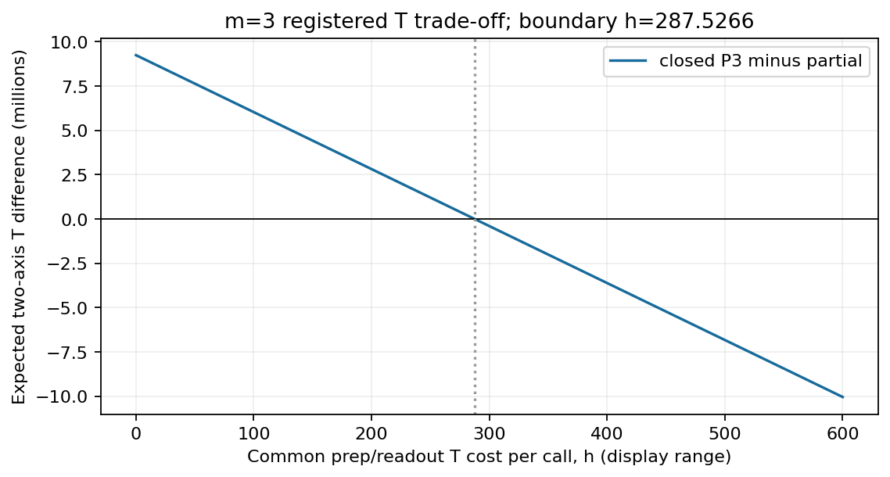
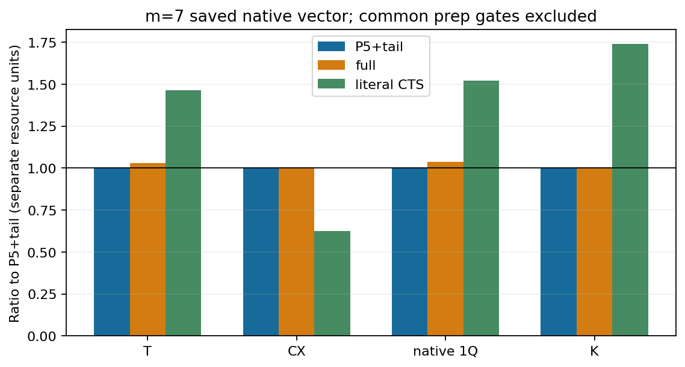
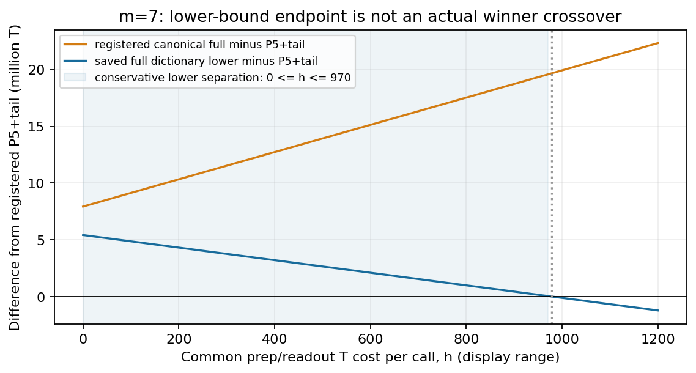

# 有限Taylor RTEの形式return集約：局所生成、P5特殊化とnative資源上の限界

技術・方法ノート v1.0 — 2026-10-11 JST

## 要旨

Hermitian involutionの正の線形結合からなる有限Taylor演算子について、隣接同labelの消去で同じ語へ戻る
寄与を集約し、単一involution回転と偶数語を用いる乱択unitary表現を記述する。short-step条件下での
係数正値性、局所係数query、未知global normalizerを入力に要求しない生成、有限bit確率と補正weightを
一つの手順として示す。P5ではroot・ordered pair・長さ4のfirst-label群により、normalizerを高々L²+1群から
構成できる。

固定した3-qubit nativeモデルの同一次数比較では、一般full集約の登録T費用は対応するclosed対照より
大きい。m=7では、辞書・合成列・confidence policyを固定した任意proposalの下界も、共通準備単価の
一定範囲でclosed P5＋tailの登録費用を上回る。一方、低次数P5のliteral CTS対照へのT利益と、CTS側の
CX利益は両立する。形式係数質量、support、量子呼出し数、native総費用を区別した構成と適用限界の記録である。
結合全体の優先性や一般PR/QPE改善を確定するものではない。

## 1. 対象、記号と問い

正の有理数p_i、Σ_i p_i=1、L個のHermitian involution Q_i²=Iを与える。奇数m≥1、0<x≤1、σ∈{−1,+1}に対し

\[
R=\sum_{i=1}^{L}p_iQ_i,\qquad
M_m=P_m(-i\sigma xR)=\sum_{n=0}^{m}\frac{(-i\sigma xR)^n}{n!}
\tag{1}
\]

を対象とする。零質量labelは除外でき、x=0はidentityとして別扱いする。問いは、**同じ有限first operator
momentを実現する複数のensembleで、形式returnの集約が生成法とnative資源をどう変えるか**である。
exp(−iσxR)へのTaylor remainder、長時間積、QPEのエネルギー精度は評価対象に含めない。

語u=(i₁,…,i_l)に対しQ(u)=Q_i₁…Q_i_l、p(u)=Π_t p_i_tとする。隣接iiを消去して得るreduced wordを
red(u)と書く。「全形式return」はQ_i²=Iだけによるこの消去をすべて含むという意味であり、Pauliの
交換・反交換や別語の物理的な一致まで収集する意味ではない。Q(u)はoperatorの左から右の順序で、
実際のcircuit時間順は逆になる。一般の奇数Q(u)をinvolutionと仮定しない。

|u|を語長、t_n=x^n/n!、χ=Σ_i p_i²、μ_k=Σ_i p_i^kとする。以下でBは係数質量、Zは受理率、Nは一axisの
全試行数、K=2NZは二axesの期待量子呼出し数である。確率/root精度はH_prob/H_rootで表し、Kと区別する。

coherent-axisの対象はReまたはIm Tr(ρM_m)である。unitaryのglobal phaseもcontrolled枝間の相対位相になる。
従ってensemble channelの一致だけでoperator平均の一致を代用しない。

## 2. 集約係数の成立とparent pairing

P_n(u)=Pr[red(I₁,…,I_n)=u]、I_tはpからのIID labelとする。reductionがparityを保存することから

\[
a_u=\sum_{\substack{|u|\le n\le m\\n-|u|\ {\rm even}}}
(-1)^{(n-|u|)/2}t_nP_n(u),\qquad
M_m=\sum_{u}(-i\sigma)^{|u|}a_uQ(u).
\tag{2}
\]

これは有限Taylorのraw語を同じ形式語へまとめた恒等式であり、語のreorderを必要としない。
位相は(−iσ)^n=(−iσ)^|u|(−1)^((n−|u|)/2)から得る。

### 2.1 Short-step正値性

長さn+2でuへreduceする語は、隣接pairを一つ消去すると長さnで同じuへ戻る。長さnの各語のn+1個の
gapsへiiを挿入するmultisetは対象を覆うため

\[
P_{n+2}(u)\le(n+1)\chi P_n(u),\qquad
\frac{t_{n+2}P_{n+2}(u)}{t_nP_n(u)}\le\frac{\chi x^2}{n+2}\le\frac12.
\tag{3}
\]

P_n(u)=0の場合もcoverからP_{n+2}(u)=0となる。多重生成があるため、最初の不等式を等式と扱わない。
有限alternating sumの最初の二項と一項を下界・上界に取れば、l=|u|に対し

\[
t_lp(u)\left(1-\frac{\chi x^2}{l+2}\right)\le a_u\le t_lp(u),\qquad a_u>0.
\tag{4}
\]

追加項が存在しない末尾でも同じ弱い下界を使える。正値性は0<x≤1という仮定付きであり、x>1へ延長しない。
これは既存のG6証明を本文へ移したもので、数値fixtureの一致を一般証明の代わりに用いていない。[E1]

### 2.2 偶数parentと単一involution回転

偶数長reduced uをparentとする。空parentでは全label、非空parentではi≠first(u)をchild集合C(u)とする。
各奇数reduced語iuは最初のlabelを除けば唯一の偶数suffixを持つので、重複なくpairできる。

\[
s_u=\sum_{i\in C(u)}a_{iu},\quad d_u=\sqrt{a_u^2+s_u^2},\quad
\phi_u=\arctan(s_u/a_u),\quad q(i\mid u)=a_{iu}/s_u,
\tag{5}
\]
\[
V_{u,i}=(-i\sigma)^{|u|}e^{-i\sigma\phi_uQ_i}Q(u).
\tag{6}
\]

Q_i²=Iからcosφ_u=a_u/d_u、sinφ_u=s_u/d_uとなり

\[
d_u\sum_iq(i\mid u)V_{u,i}
=(-i\sigma)^{|u|}a_uQ(u)+\sum_i(-i\sigma)^{|u|+1}a_{iu}Q_iQ(u).
\tag{7}
\]

右辺はparentと全childを一回ずつ再構成する。s_u=0なら純parentを扱う。回転generatorはQ_iだけであり、
一般の奇数語ではない。parentの(−iσ)^|u|=(−1)^(|u|/2)はcontrolled実装で保持する。
Euler pairingの基本原理はordinary RTEにもある。ここで異なるのは、return集約後のparentごとの係数と分布である。
ordinaryの既知samplerは次数とIID labelから生成する。[Wan–Berta–Campbell, Appendix C / Algorithm 2](https://arxiv.org/pdf/2110.12071v2)

## 3. 局所係数queryとglobal normalizerなしの生成

### 3.1 形式級数によるquery

Q_i²=Iだけの形式語はfree product of Z₂のCayley tree上のwalkとして扱える。形式first-passage級数F_iと
root return級数Gは

\[
F_i(z)=\frac{zp_i}{1-z\sum_{j\ne i}p_jF_j(z)},\quad F_i(0)=0,\qquad
G(z)=\frac1{1-z\sum_ip_iF_i(z)},
\tag{8}
\]
\[
\sum_{n\ge0}P_n(u)z^n=G(z)\prod_{t=1}^{|u|}F_{i_t}(z).
\tag{9}
\]

根からuまでの唯一のsimple pathをfirst-passageで通過し、最後にroot return因子を掛ける分解である。
scalar積は可換でもQ(u)の順序は変えない。z=0での形式解を次数順に求めればよく、数値resolventのbranchや
infinite samplingは必要ない。L=1ではF₁=z、G=(1−z²)^−1を含む。

式(8)–(9)は既知free-product Green multiplierのZ₂特殊化である。
[Aomoto–Kato, §1 Eq.(1.6), Lemma 1.1, pp.62–65](https://www.numdam.org/item/AIF_1988__38_1_59_0.pdf)
に対し、同論文のwalk重みをp_i/2、spectral変数をζ=1/zとし、resolventをzで割る対応を使う。
この有限Taylor queryへの対応は本構成側の説明であり、原論文に以下のRTE samplerがそのままあるという意味ではない。

f_i[n]=[z^n]F_i、C[n]=Σ_i p_i f_i[n]とすると

\[
f_i[n]=p_i\mathbf1_{n=1}+\sum_{b=1}^{n-2}f_i[b]\big(C[n-1-b]-p_if_i[n-1-b]\big),
\tag{10}
\]
\[
G[0]=1,\qquad G[n]=\sum_{a=1}^{n-1}C[a]G[n-1-a].
\tag{11}
\]

低次数から全iを求めC[n]を共有する。一つのparentの式(9)をm次までconvolveし、childにはcached parent
seriesとF_iを掛けることで、a_uと全a_iuを局所取得する。過去語を蓄積して全辞書を作る必要はない。

### 3.2 Ordinary envelopeと一試行の手順

偶数l≤m−1についてb_l=√(t_l²+t_(l+1)²)、B_ord=Σ_l b_lとする。式(4)から

\[
d_u\le b_lp(u),\qquad
B_{\rm full}:=\sum_{u\ {\rm even,reduced}}d_u\le B_{\rm ord},\qquad
A_u:=\frac{d_u}{b_lp(u)}\ge\frac1{2\sqrt2}>\frac14.
\tag{12}
\]

次のideal手順が指定した集約ensembleを生成する。

1. lをb_l/B_ordで選び、長さlのraw IID語をpから得る。
2. raw語に隣接同labelがあれば、その試行をzeroとする。reduce先の別parentへ再配分しない。
3. reduced parent uなら式(8)–(11)をqueryし、A_uで受理する。拒否はzeroとする。
4. 受理後、iをa_iu/s_uで選び、位相を保持したV_u,iを用いるaxis Hadamard測定Y∈{−1,+1}を行う。
5. 受理時X=B_ord Y、その他X=0とし、**全試行数**を分母に平均する。

Pr(u accepted)=d_u/B_ordとなるので

\[
Z=\frac{B_{\rm full}}{B_{\rm ord}},\quad
E[X]=\operatorname{Re}\text{ or }\operatorname{Im}\operatorname{Tr}(\rho M_m),\quad
E[X^2]=B_{\rm ord}B_{\rm full},\quad |X|\le B_{\rm ord}.
\tag{13}
\]

既知B_ordだけでweightを付けられ、B_fullの全列挙取得は不要である。ただしaccepted-only平均では式(13)にならない。
empty-parentからZ≥(1−χx²/2)e^−x≥1/(2e)を得る。拒否を含む古典処理も課金する。
m≥3,x>0ではempty-parentの上界がstrictになるためideal B_full<B_ordだが、native総費用の改善は従わない。

ZeroFillとDiscardのnormalization区別は既知である。
[Cugini–Atif–Subaşı, §IV.1–IV.2](https://arxiv.org/html/2603.13495v1)
のプロトコルと区別して、ここでは量子実行前の局所classical coinを用いる。

### 3.3 未知Zを予算へ無料利用しない

axisの残余誤差幅s>0、failure αに対するBernstein十分予算は、認証済みZ_+を用いて

\[
N\ge\left\lceil\log(2/\alpha)
\left(\frac{2B_{\rm ord}^{2}Z_+}{s^2}+\frac{4B_{\rm ord}}{3s}\right)\right\rceil.
\tag{14}
\]

追加情報なしならZ_+=1である。G10のlocal fullは全B_fullではなく、rootとraw-reduced質量から得る上界Uを使う。
raw-reduced長lの質量r_lはv_i(1)=p_i、v_i(l)=p_i(Σ_jv_j(l−1)−v_i(l−1))、r_l=Σ_iv_i(l)で求まり

\[
B_{\rm full}\le U=d_\emptyset+\sum_{l=2,4,\ldots,m-1}b_lr_l\le B_{\rm ord}.
\tag{15}
\]

root intervalとr_lのO(Lm)処理による上界であり、全parentのnormalizerではない。
finite-bit版では式(18)の丸め係数を戻す。exact signalやreference B_fullを使ったshot削減は行わない。

## 4. 有限bitの平均、bias、input/accessと計算量

### 4.1 実proposalと補正weight

ideal b_l、d_u、φ_uは一般にirrationalであり、有限bitのexact samplerとは区別する。既存構成では、order・label・
acceptance・childの各確率をfull-support dyadic値へ丸める。有理近似d̃_uを使い

\[
\pi_{u,i}=h_l\prod_{j\in u}h_j\,h_Ah_{i\mid u},\quad
\widetilde\alpha_{u,i}=\widetilde d_u\frac{a_{iu}}{s_u},\quad
\widetilde W_{u,i}=\frac{\widetilde\alpha_{u,i}}{\pi_{u,i}}.
\tag{16}
\]

実際のπをweightへ戻すためπ W̃=α̃はexact rationalで成立する。zero試行も全試行数へ含める。
angleをidealのまま考えた平均はM̃=Σα̃Vであり、一般には元のM_mへのexact一致ではない。
確率丸めの補正と、係数・angle近似のbiasを分ける。

各dyadic massがidealの(1±η)内、|d̃_u−d_u|≤ρd_u、0<η,ρ<1なら、l≤m−1より

\[
\pi_{u,i}\ge(1-\eta)^{l+3}\alpha_{u,i}/B_{\rm ord},\quad
|\widetilde W|\le\frac{(1+\rho)B_{\rm ord}}{(1-\eta)^{m+2}},\quad
\|\widetilde M-M_m\|\le\rho B_{\rm full}\le\rho B_{\rm ord}.
\tag{17}
\]

pure-parentにchild因子がない場合もこの保守的上界を使える。digital second momentをideal値と同一視せず

\[
E[\widetilde X^2]\le\kappa B_{\rm ord}U,\qquad
\kappa=\frac{(1+\rho)^2}{(1-\eta)^{m+2}}
\tag{18}
\]

を使える。UなしならB_ordを代入する。B_ord≤e^x<3から、global norm取得なしにrangeとbiasも保守的に認証できる。
native event近似V̂_eに||V̂_e−V_e||≤δ_eがあれば、operator mean差は

\[
\|\sum_e\widetilde\alpha_e\widehat V_e-M_m\|
\le\rho B_{\rm ord}+\sum_e\widetilde\alpha_e\delta_e
\tag{19}
\]

以下である。測定task固有のbias係数は別に定める。controlled phaseを捨てたprojective errorでは代用しない。

### 4.2 Boundedな確率・root構成

short-stepではorder質量≥t_(m−1)/3、label≥p_min、valid-parent acceptance>1/4、存在するchild質量≥p_min/2、
d_u≥t_(m−1)p_min^(m−1)/2という下界がある。各inverseのlogは入力bit長とmに多項式で抑えられる。
従って指定η,ρに対し、相対精度を満たす有限precisionの選択が可能である。[E2]

既存実装はinteger isqrtから分母2^H_rootのoutward root区間を一回構成し、midpoint normalizationと
largest remaindersでdyadic massを作る。各massがq̃≥(1−η)q_hi、q̃≤(1+η)q_loを満たすことを検証する。
acceptanceは下向きに丸める。precision不足ではfail closedし、sampler retryやランダムなbit追加を行わない。

固定H_prob=160/H_root=256が任意入力で十分とは主張しない。一般のprecision選択可能性と、固定precisionの
prototypeで不足時に停止する仕様は別である。random bit interfaceの決定的mappingを実装したことも、
物理量子shotsや統計精度の実験を行ったこととは異なる。

角度も別に有限precision化する。式(4)/(12)からr=s_u/a_u≤2x/(l+1)≤2である。
φ=2 atan[r/(1+√(1+r²))]の内部引数は2/3未満なので、outward root区間とalternating atan級数の次項上界で
角度を囲める。必要項数はlog(1/τ)に多項式で、involution回転のangle誤差τはstrict operator差τ以下に戻せる。
これは係数/角度の数理処理可能性であり、native列のT価格やonline取得時間の保証ではない。[E2]

### 4.3 計算量と必要なoracle

| 処理 | 一般local構成の算術量／保持量 |
| --- | --- |
| F_i/Gのm次前処理 | O(Lm²) rational operations、O(Lm)係数 |
| 一parentと全childのquery | O(m³+Lm²) rational operations |
| raw語の隣接判定 | O(m)、語状態O(m log L) bits |
| root・確率・係数 | 入力bit長、m、log(1/η)、log(1/ρ)を含むprecision費用 |
| native取得・古典sampling | 上の係数算術に含めず、別に課金 |

pの総bit長H_p、xのbit長H_x、D=lcm denominator(p_i)とするとlogD≤H_p。確率級数n次は分母D^nで表せる。
a_uの分母はD^m den(x)^m m!を割り、係数bit長はO(m(H_p+H_x+logm))となる。
rational operation数はbit operation数・実時間ではない。mの数値に多項式という記述をlogmへの多項式性と読み替えない。

必要なaccessはpの明示table、controlled Q_i、signed controlled exp(−iσφQ_i)、位相・strict error・workspace・
native費用の証拠である。system-only Q_iからcontrolled oracleが無料に得られるとはしない。
φ_uは語長だけで決まらず、label構成にも依存する。非列挙の係数生成から、O(m)種類の合成角度、安いonline synthesis、
DF取得費用優位は従わない。G6時点のnative未接続と、後のG9/G10の小さい明示provider接続を区別する。

## 5. P5のclosed少数群構成

P5のeven parentは長さ0,2,4である。t_n=x^n/n!とχ,μ₃,μ₄,μ₅から、rootは

\[
a_0=1-\chi t_2+(2\chi^2-\mu_4)t_4,
\tag{20}
\]
\[
a_i=p_i\{t_1-(2\chi-p_i^2)t_3+
(5\chi^2-4\chi p_i^2+2p_i^4-2\mu_4)t_5\},\quad s_0=\sum_i a_i.
\tag{21}
\]

ordered pair u=(j,k)、j≠kには、scalar

\[
A_{jk}=t_2-(3\chi-p_j^2-p_k^2)t_4,
\tag{22}
\]
\[
b_i^{jk}=\begin{cases}
p_i\{t_3-(4\chi-p_i^2-p_j^2-p_k^2)t_5\},&i\ne j,\\0,&i=j,
\end{cases}
\tag{23}
\]
\[
S_{jk}=(1-p_j)t_3-
\{(1-p_j)(4\chi-p_j^2-p_k^2)-(\mu_3-p_j^3)\}t_5
=\sum_i b_i^{jk}
\tag{24}
\]

を用い、a_jk=p_jp_k A_jk、a_ijk=p_jp_k b_i^jk、d_jk=p_jp_k√(A_jk²+S_jk²)とする。
angle tangentはS_jk/A_jk、child lawはb_i^jk/S_jkである。

長さ4のreduced uでfirst(u)=jなら

\[
a_u=t_4p(u),\quad a_{iu}=t_5p_ip(u)\ (i\ne j),\quad
d_u=p(u)\sqrt{t_4^2+(1-p_j)^2t_5^2},\quad
\tan\phi_u=x(1-p_j)/5.
\tag{25}
\]

このangleとroot因子はfirst labelだけに依存する。h_j(0)=1、h_j(r)=Σ_(k≠j)p_k h_k(r−1)とし、
r_j^(4)=p_jh_j(3)=Σ_(|u|=4,first(u)=j,reduced)p(u)を得る。normalizerは

\[
B_5=d_0+\sum_{j\ne k}p_jp_k\sqrt{A_{jk}^2+S_{jk}^2}
+\sum_jr_j^{(4)}\sqrt{t_4^2+(1-p_j)^2t_5^2}.
\tag{26}
\]

群数はroot 1、ordered pair L(L−1)、first-label Lで高々L²+1である。L=1では非root群を省く。
同じideal P5 ensembleを全child表なしで生成する具体的な特殊化であり、汎用器をm=5で呼ぶだけではない。
各存在群の係数正値性とangle/child正規化の非零性は§2のshort-step証明から従う。

### 5.1 生成手順

1. 式(26)の各群質量を構成し、B5で正規化して群を選ぶ。
2. root群なら空語、pair群なら指定(j,k)をparentとする。
3. first-label j群ならjから始める。残りr個の語の次label k≠previousをp_k h_k(r−1)/h_previous(r)で選ぶ。
   長さ4まで繰り返すと、群内のparent lawはp(u)/r_j^(4)となる。
4. root/pairのchild lawは式(21)/(23)を正規化する。長さ4ではi≠jをp_i/(1−p_j)で選ぶ。
5. 式(6)のunitaryを生成する。ideal coefficient samplerではweight B5、finite-bit版では実proposalで補正する。

finite-bit版は各**群質量**をoutward rootで囲み、有理midpointをideal群内比率へ掛けたtarget係数を用いる。
その係数を丸め済みの群・word・child proposalで割る。群ごとのrelativeρをL1で足せばbias≤ρB5となる。
一般local器とideal ensembleは同じでも、finite rational係数までbyte-exact同一である必要はない。

### 5.2 根拠と計算量

reduced長lの語に一pairだけ挿入する場合、triple同labelの重複を各文字位置で引くと

\[
P_{l+2}(u)=p(u)\{(l+1)\chi-\sum_{t=1}^{l}p_{i_t}^{2}\}.
\tag{27}
\]

式(3)の一般挿入上界とは異なり、この一returnの場合は重複を補正した等式である。
walk再帰からP₂(empty)=χ、P₃(i)=p_i(2χ−p_i²)、P₄(empty)=2χ²−μ₄、
P₅(i)=p_i(5χ²−4χp_i²+2p_i⁴−2μ₄)を得る。これらと式(27)を式(2)へ代入すれば式(20)–(25)となる。
G9の既存導出と凍結sourceに対応しており、今回新しいGreen evaluatorや数値checkerを動かしていない。[E3]

群構築はO(L²) rational operations、DPはr≤3のO(L)状態に対するO(L²)処理である。
μ₃の共有により各S_jkをO(1)で求め、(j,k,i)全表を作らない。word/childの各local conditionalはO(L)。
これは**群index選択も含む全実行時間がO(L)という主張ではない**。現`dyadic_index`は群lawの線形scanで、
群数がO(L²)ならそのlookupもO(L²)になり得る。root精度・有理bit量・native合成費用も別である。
群数から古典実時間優位を推測しない。

## 6. 固定nativeモデルとconfidence会計

### 6.1 入力、同じtarget、実装範囲

比較例はp=(1/5,3/10,1/2)、x=5/7、σ=+1、m∈{3,5,7}、3 system qubitsに固定する。

\[
Q_0=Z_0,\quad V_1=R_{XX_{01}}(\pi/4),\quad
V_2=R_{XX_{12}}(\pi/4)R_{ZZ_{01}}(\pi/4),\quad Q_i=V_i^\dagger Z_iV_i,
\tag{28}
\]

R_P(θ)=exp(−iθP/2)とする。追加関係を使わず形式集約を実装できるが、このproviderではPauli展開も明示取得可能なI1文脈である。
I0しか使えない実問題、分子geometry/chemistry basis/DF rank/split L_Dへの優位を実証した条件ではない。

ordinary、partial return、closed P3＋tail、local full、closed P5、matched CTSを各mの同じfull finite P_m内で比較する。
closed P5はm=5では式(26)、m=7ではP5部分とordinary n=6/7 tailを組み合わせる。
「partial_return_tail」はrootのidentity-returnの一部を吸収した既存armであり、式(2)の全形式returnではない。
m=3のP3はP5の式をt₄=t₅=0で切ったroot、pair部分に対応する。
次数間を等exponential精度のランキングにしない。

matched CTSは同じ有限多項式の実・虚部分をPauli収集し、odd側を単一回転へpairするfinite specializationである。
real correctionのidentityを含むevent、T=0 eventも保持する。
[Peetz–Smart–Narang, Theorem 1 / Supplementary Note 5](https://arxiv.org/html/2407.21095v2)
の構成へ対応するliteral実装で、CTS family内の全最適化法ではない。

全方式に同じdirect V†–controlled Pauli rotation–Vを許し、controlled parent位相、signed rotation、actual adjointを保持する。
CZ→H CX Hとadjacent inverse cancellationを共通適用し、literal native列のT/T†・CX・1Qを数える。
providerのπ/4列はこのClifford+Tモデルでexact、δ_provider=0。system-only oracleを無料のcontrolled oracleへ置き換えない。
全回路の大域最適compileや最良synthesizerの結果ではない。追加workspaceは外側ancilla 1である。

### 6.2 四つの誤差を分ける

| 対象 | 本ノートでの扱い |
| --- | --- |
| finite Taylorとexponentialとの差 | 今回の比較task外。各方式は同じP_mを対象とする |
| finite-bit coefficient mean bias | 共通上界8ρに含める |
| strict controlled native error | Rz一primitive ε_Rz=10⁻⁶、event composition≤2ε_Rz、up_to_phase=false |
| statistical error | bias控除後のsに共通Bernstein十分予算を適用 |

H_prob=160、H_root=256、η=ρ=10⁻¹²。全representationにB<8を用い、共通coherent biasは

\[
b_{\rm coh}=2\{8\rho+8(1+\rho)2\epsilon_{Rz}\},\qquad
s=1/200-b_{\rm coh}>0.
\tag{29}
\]

保守的なfactor 2を含む固定taskの会計である。float matrix tolerance 10⁻¹⁰はphase・順序診断用で、
認証biasの代わりに用いない。exact signalは資源予算を縮めるために使わない。

### 6.3 十分shots、期待費用、tail/hard上限

M₂,+とW_+を既知のsecond-moment/range上界とすると

\[
N=\left\lceil\ell_+\left(2M_{2,+}/s^2+4W_+/(3s)\right)\right\rceil,
\quad\ell_+\ge\log(2/\alpha_{\rm axis}),\quad\alpha_{\rm axis}=49/34000.
\tag{30}
\]

local fullは式(18)のB_ord,Uのoutward上界を使う。closed P5は少数群normalizer、CTSはcollected I1 normを使う。
referenceのZやsecond momentを未知情報としてlocal予算に注入しない。
34α_axis=49/1000、各rowのresource failure β=1/17000、17β=1/1000で、全failure合計1/20となる。

保存されたevent proposal π_eとnative価格C_eについて

\[
Z=\sum_e\pi_e,\quad K=2NZ,\quad
C_{0,j}=2N\sum_e\pi_eC_{e,j},\quad
G_j(h_j)=C_{0,j}+Kh_j\quad(j=T,CX,1Q).
\tag{31}
\]

h_j≥0は共通prep/readout単価で、結果後に都合のよい単価を選んで勝者を固定しない。
native 1QにはTも含まれ、Tと1Qを独立費用としてそのまま加算しない。共通外側1Qの保存fieldも別であり、
表のnative切片に勝手に混入しない。

二axesの全試行M=2N、受理率上界Z_+、t_resource=10に対し、登録accepted-call capは

\[
C_{\rm acc}=\min\{M,\lceil MZ_++\sqrt{2MZ_+t_{\rm resource}}+2t_{\rm resource}/3\rceil\}.
\tag{32}
\]

rootをoutward評価し、Z_+=1ならMとする。exp(−10)<1/17000でresource failureを課金する。
期待費用C0、accepted-tail上限C_acc max_eT_e、hard上限2N max_eT_eは別量である。
実際にN回の量子shotsを実行した結果ではなく、固定confidence taskの十分資源会計である。

## 7. 既存native比較の結果

### 7.1 全17行の表示表

以下は凍結済み保存有理数の表示のみで、全数値を百万単位、小数6桁へ丸めている。再最適化・再classificationではない。
正確なN、normalization、Z、moment/range、tail/hard costと資源係数は付録Cのexact tableにある。
row 0–5は既存G9 native値を共通34-axis予算へ戻したG10 anchorであり、G9原結果自体は不変である。

| row | m | 方式 | T切片 / 10⁶ | CX切片 / 10⁶ | native 1Q切片 / 10⁶ | K / 10⁶ |
| ---: | ---: | --- | ---: | ---: | ---: | ---: |
| 0 | 5 | ordinary | 371.085420 | 21.904736 | 996.749433 | 2.651626 |
| 1 | 5 | partial_return_tail | 275.437399 | 16.998103 | 731.603229 | 2.019804 |
| 2 | 5 | closed_P3_tail | 284.749630 | 17.095837 | 734.643184 | 1.987402 |
| 3 | 5 | full_return | 273.991326 | 16.756376 | 692.820724 | 1.964236 |
| 4 | 5 | closed_P5_full | 272.239831 | 16.649261 | 688.391854 | 1.951680 |
| 5 | 5 | matched_CTS | 387.633441 | 10.391732 | 968.944321 | 3.396808 |
| 6 | 3 | ordinary | 365.035172 | 21.419239 | 980.769210 | 2.613128 |
| 7 | 3 | partial_return_tail | 270.220208 | 16.572049 | 717.894571 | 1.986222 |
| 8 | 3 | closed_P3_tail | 279.459012 | 16.670105 | 720.920647 | 1.954090 |
| 9 | 3 | full_return | 279.999178 | 16.702326 | 722.314113 | 1.957867 |
| 10 | 3 | matched_CTS | 400.847851 | 10.470333 | 1036.410493 | 3.429708 |
| 11 | 7 | ordinary | 371.179562 | 21.914206 | 996.997917 | 2.652280 |
| 12 | 7 | partial_return_tail | 275.518709 | 17.006422 | 731.816636 | 2.020376 |
| 13 | 7 | closed_P3_tail | 284.832047 | 17.104130 | 734.856468 | 1.987968 |
| 14 | 7 | full_return | 280.249068 | 16.756533 | 715.218431 | 1.964243 |
| 15 | 7 | closed_P5_tail | 272.320319 | 16.657452 | 688.598158 | 1.952240 |
| 16 | 7 | matched_CTS | 399.058971 | 10.392764 | 1048.816689 | 3.397242 |

### 7.2 一般fullの追加registered T利益

各mのclosed対照に対するfullの差は次の通り。

| m | 同次数の対照 | fullのT切片増加 | fullのK増加 |
| ---: | --- | ---: | ---: |
| 3 | closed P3 | 約0.19329% | 約0.19329% |
| 5 | closed P5 | 約0.64336% | 約0.64336% |
| 7 | closed P5＋tail | 約2.91155% | 約0.61484% |

保存されたexact差はどちらも正なので、登録canonical fullのT費用は各比較で全h≥0にわたり大きい。
m=3/5のfullとclosedは同じideal ensembleを共有するが、local envelopeと少数群normalizerの予算会計が異なる。
m=7のP5＋tailとfullは異なるensembleであり、追加return集約のnative価値を判別する。
一般fullが全入力・全backendで不要という結論にはならない。

### 7.3 準備単価、root価格と別資源trade-off

m=3ではpartial returnはT切片が低く、closed P3はKが低い。二affine式の登録境界はh≈287.5265937973である。
この境界は保存費用の感度で、どのhを採用すべきかという判断を含まない。



図1：closed P3−partialの登録T費用差。0–600は既存affine式の表示範囲で、新しい科学条件ではない。

m=7の空parentでは、P5＋tailのtangentが2189372/2921709、fullが9011383315/12025404923となる。
保存native Tは各childで[136,138,140]から[140,142,144]へ変化し、rootは受理回路の約87.8%を占める。
追加集約が頻出回転の合成価格も変えた具体例であり、全費用差の一意の原因帰属とはしない。

P5系はliteral CTSとordinaryに対する登録T利益を保つ。一方m=7のCX切片はCTS約10.393百万、P5＋tail約16.657百万。
共通prep CX単価gを含む境界は約4.3354181512である。全資源をstrictに支配するとの主張ではない。



図2：P5＋tailに対するT、CX、native 1Q、Kの比。共通prep gateを加えていない別座標であり、座標間を足さない。
登録P5のT利益はCTS family全体への優位ではない。

## 8. 固定辞書・同じpolicyでのsampling-only限界

固定positive event係数a_e、unitary V_e、native T価格T_e≥0、合成列・precision、残余誤差s、failure αを保つ。
任意full-support proposal q_e>0、Σq_e≤1について、残りを量子実行前のzero trial、weightをa_e/q_eとする。

\[
M_2(q)=\sum_ea_e^2/q_e,\qquad C(q;h)=\sum_eq_e(T_e+h),\quad h\ge0.
\tag{33}
\]

Cauchy–Schwarzから

\[
M_2(q)C(q;h)\ge\left(\sum_ea_e\sqrt{T_e+h}\right)^2.
\tag{34}
\]

これは既知cost–moment関係の固定辞書版であり、新しいimportance-sampling最適化定理ではない。
[Cugini–Atif–Subaşı, Theorem 1, Eqs.(9)–(10)](https://arxiv.org/html/2603.13495v1)
を参照する。T_i,T_j,h≥0なら

\[
\sqrt{(T_i+h)(T_j+h)}\ge\sqrt{T_iT_j}+h,
\tag{35}
\]

両辺の二乗の差はh(√T_i−√T_j)²≥0である。式(34)の二重和へ式(35)を適用し、Bernstein十分予算の
正のrange項とceilingを落とせば、二axes費用について

\[
G(q;h)\ge\frac{4\log(2/\alpha)}{s^2}
\left[\left(\sum_ea_e\sqrt{T_e}\right)^2+h\left(\sum_ea_e\right)^2\right].
\tag{36}
\]

zero-T eventも係数質量とsamplingに含める。保存sourceはroot/logの下側有理近似を使うため、式(36)を保守的に
評価している。最適proposalを構成したり、ゼロ価格eventを捨てて等号達成を主張したりはしていない。[E5]

### 8.1 具体的なm=7分離

保存full下界と登録P5＋tail予算の差は、表示値で

\[
L_F(h)-G_{P5+tail}(h)\simeq5,415,782.443240-5,537.20852461h.
\tag{37}
\]

正確な有理差は0≤h≤970で正、h=970でも約44,690.174365 Tの余裕がある。約978.0708852063は
下界による分離端点であり、実行可能lawのwinner crossoverではない。それを超えるhで改善例が存在することも示さない。
canonical fullの不利は別のT/K両正差から全h≥0で残る。



図3：P5＋tailを基準とする二種類の差。青線は保存された全proposal下界、橙線は登録canonical費用。
青線の端点は実際のwinnerの反転を意味しない。0–1200は既存式の表示範囲である。

m=5/7のliteral CTS固定辞書下界と登録P5系の差も、保存fieldの切片・prep slopeとも正で全h≥0に分離される。
これはcanonical順位表より強い、特定比較クラスの限界である。root/log下界の再生成やproposal探索はこのノート作成時に行っていない。

### 8.2 比較class外と一般化の限界

式(36)は、辞書、native価格、precision、bias、残余幅、failure配分、十分予算policyを固定したclassの費用下界である。
物理的な最低shot数、state-dependent最適推定、あらゆる量子queryの下界ではない。別辞書・event統合・合成列/precision変更・
別推定法はclass外である。m=7の分離をm=3/5や別入力へ一般化しない。

同じfinite target・比較可能なnative実装における一事例は、「係数質量またはsupportが小さければnative総費用も必ず減る」
という普遍的含意を支持しない。しかし改善/悪化の一般頻度、別装置での傾向、PR全体の費用を推定する根拠にはならない。
費用とmomentを同時に考える原理自体を初めて発見したとは主張しない。

## 9. 関連研究との対応と残る限定

| 一次文献の内容 | 本ノートとの具体的対応 | 主張しない内容 |
| --- | --- | --- |
| Wan–Berta–Campbellの隣接次数pairing、次数/IID sampler [P1] | 式(5)–(7)はreturn集約後のeven suffixとchild全質量をpair | one rotation、非列挙性だけの新規性 |
| Zhao–Yuanの高次寄与の低次数unitaryへの吸収 [P2] | 式(2)はQ_i²=Iによる固定finite P_m内の形式returnをすべて保持 | modified Taylor targetと同じensembleという無検証な同一視 |
| Aomoto–KatoのGreen multiplierとspectral shift [P3] | 式(8)–(11)はZ₂特殊化を有限係数queryに用いる | 新しいfree-product定理、元論文にRTE全手順があるという主張 |
| Peetz–Smart–NarangのCTS、Pauli収集と層sampling [P4] | 同じfinite operatorへ特殊化したliteral CTSを比較 | CTSが常に全語列挙を要する、CTS family全体への優位 |
| Cugini–Atif–Subaşıのcost-aware IS、ZeroFill/Discard [P5] | 式(13)/(16)と式(34)–(36)の固定native-policy適用 | 新しいresource-optimal sampler、普遍的shot最適性 |
| PR原論文のRTEとinvolutionの位置付け [P6] | 同じランダム側へ接続し得る有限step構成の記述 | 一般involutionの使用だけの新規性、PR/QPE総改善 |

CTSのSupplementary Note 3は層別samplingによる非列挙生成を示し、層間簡約を逃すことを明示する。[P4]
本構成の形式集約は指定finite stepの全形式returnを保持するが、Pauli全簡約とは異なる。
ordinary RTEにも非列挙samplerがあるため、比較に全列挙evaluatorを代用した古典勝利を主張しない。

指定された集約分布を局所係数とfinite-bit補正で生成する具体性はあるが、既知要素の結合全体の優先性・非自明性は未確定である。
同じ結合手順を確認範囲で特定しなかったことを新規性の証明にしない。また部品が既知であることだけから全手順が既知とも断定しない。
本ノートは構成と固定native事例を提示し、独立した新規アルゴリズム論文としての投稿十分性を採択しない。

binding supportの255対2,250というm=7件数は参照辞書の性質であり、一意回路数やproductionの時間・メモリ比ではない。
両生成法とも毎trialに全表を列挙するものではない。固定runtimeやinterface traceは方式別のscaling benchmarkでもない。
T/CX/1Qの改善領域をgeometry・DF rank・長時間PRへ移すには別の対象・access・費用契約が必要である。

## 10. 結論

有限Taylor meanについて、形式return集約の正値性、parent pairing、局所生成、有限bitの補正とbiasを明示した。
P5のL²+1以下の群は一般構成の具体的な低次数実装を与える。固定native事例では一般fullの追加registered T利益がなく、
一定の共通準備単価範囲では同じ辞書内のsampling変更だけによる救済も下界で分離される。

係数質量・supportの減少と、native価格・十分予算・情報取得を含む総資源の減少は別である。
低次数P5の成果と一般構成の数学的内容を保ち、そのnative適用限界を記録する技術・方法ノートとして現系列を区切る。
一般入力での性能優位、PR/QPE改善、構成全体のpriority、査読採択可能性はこの記録から確定しない。

## 付録A：式(3)、母関数、P5導出の補足

挿入coverでは、対象raw語の最初の隣接pairを決定的に消せば長さnの語になる。その語の全gapへ各iiを挿入し直す
multisetは、元の全対象を少なくとも一回含む。各挿入の重みはp_i²倍なので式(3)となる。式(27)ではreduced baseへ
一pairだけ挿入するため、同じ出力を生む隣接gapsはbase文字とのtriple runに限られ、各文字のp_i²を一度引く。
これが一般cover上界と一return等式を区別する根拠である。

式(8)は、i方向へ進むまでにj≠i方向へ出て戻るexcursionを任意回繰り返すfirst-passage分解である。
rootの全excursionはzΣp_iF_i、語へのunique pathは各F_iの積で表される。形式級数は0で定まるため、
解析的transienceやGreen関数のinfinite branchを仮定せず有限係数を取得できる。

P5 rootの導出では、左乗算walk再帰を用いる。P₄(empty)=Σ_ip_iP₃(i)=2χ²−μ₄。
P₅(i)=p_iP₄(empty)+Σ_(j≠i)p_jP₄(j,i)に式(27)を代入すると
p_i[5χ²−4χp_i²+2p_i⁴−2μ₄]となる。長さ2・3に式(27)、長さ4・5にminimal IID質量p(u)を使い、
even/oddの符号を式(2)へ戻せば本文のclosed式を得る。physical operatorの交換・反交換を使う導出ではない。

## 付録B：証拠の種類と保持した実行来歴

一般式の根拠は本文の証明と以下の固定資料である。finite fixture・matrix diagnosis・保存値監査の役割を分ける。

| 固定資料 | 支える内容 | 支えない内容 |
| --- | --- | --- |
| [E1：G6数学監査](https://github.com/HIROMU1015/Partially-Randomized-Trotter/blob/73a7abd6547830d8c09c95637c978855af83a01e/docs/tracks/algorithm_codesign/g6_independent_mathematical_audit_20261010.md) | 集約・正値性・母関数・pairing・ideal生成の一般導出 | native性能、外部再現、独立priority |
| [E2：G6 finite-bit/access](https://github.com/HIROMU1015/Partially-Randomized-Trotter/blob/73a7abd6547830d8c09c95637c978855af83a01e/docs/tracks/algorithm_codesign/g6_finite_bit_and_access_audit_20261010.md) | exact rational補正、bias/range、support、算術/bit量 | 任意入力で固定precision十分、無料control/angle取得 |
| [E3：G9 P5導出](https://github.com/HIROMU1015/Partially-Randomized-Trotter/blob/73a7abd6547830d8c09c95637c978855af83a01e/docs/tracks/algorithm_codesign/g9_p5_matched_native_contract_20261010.md)と[凍結P5 source](https://github.com/HIROMU1015/Partially-Randomized-Trotter/blob/b9ed01455351628c9073748f5ba5751aa794b789/src/trottertracks/algorithm_codesign/g9_p5.py) | closed係数、群構築・生成、provider契約 | 世界初P5、一般classical時間優位 |
| [E4：G10 v3結果・handoff](https://github.com/HIROMU1015/Partially-Randomized-Trotter/blob/fcd3ea6217bc00b667180cec149a70102d75f07e/docs/tracks/algorithm_codesign/g10_v3_results_and_gpt_handoff_20261010.md)と[凍結contract](https://github.com/HIROMU1015/Partially-Randomized-Trotter/blob/b9ed01455351628c9073748f5ba5751aa794b789/artifacts/track_b_g10_key_compatibility_preparation/2026-10-10/v3/contract_v3.json) | 同次数native first-operator比較、予算、成功/外側status | 等exponential精度の次数ランキング、分子/DF代表性 |
| [E5：固定辞書下界source](https://github.com/HIROMU1015/Partially-Randomized-Trotter/blob/b9ed01455351628c9073748f5ba5751aa794b789/src/trottertracks/algorithm_codesign/g10_saved.py) | 保守的root/logの同一policy下界 | 実行可能最適law、普遍的量子query下界 |

G6の16 focused fixtures、G9のoff-domain fixturesは有限形式検算であり、一般証明の代用品ではない。
native operator diagnosisはphase・順序の確認で、float toleranceをconfidence certificateに代用しない。
G10の保存監査57,021項目は原出力・native IR/整数価格・保存strict error field・outer receiptの整合確認であり、
native合成・matrix誤差・log/root下界を独立に再生成した外部科学再現ではない。source-bound local evidenceである。

| 役割 | 固定identity |
| --- | --- |
| Science S3 | `b9ed01455351628c9073748f5ba5751aa794b789` |
| Authorization / 実行HEAD A3 | `53a7bc4ca8051bfd76343e98f3122c0f198e37d0` |
| G10 v3原結果commit | `fcd3ea6217bc00b667180cec149a70102d75f07e` |
| 取得性改善commit | `e65e3c0680fff4cfc4243ed5d6c87429cd5ce753` |
| 既存保存算術・図のcommit | `f41d5e3d6c12a46c7ea387c064346e160a79936a` |
| v0.1と公開確認の固定基点 | `73a7abd6547830d8c09c95637c978855af83a01e` |

原`result_v1.json`は66,842,494 bytes、SHA256
`64a867dd6cc8f5f535880607616dea72f13af1360c7468f91eef44f79c543a2f`。
statusは`G10_DEGREE_MATCHED_NATIVE_RESOURCE_MAP_COMPLETE`で、one run/retry 0。
marker SHA256は`dccfb99a7a17b4049e6827fe4223aed35dcaf4e7c8e3711c8ab758bade9db61c`。
normal exit 0、COMPLETE terminal、stderr 0、outer wall22.2261s/CPU20.0291s/peak RSS240.015625MiBを記録している。
512MiB cap内の一成功は将来の全環境保証ではない。

旧v1はRSS cap超過、旧v2はJSON key互換性によるtechnical inconclusiveとして保持する。
旧prefixを有効な科学比較へ流用せず、各旧result・marker・authorization・STOPを変更しない。
v3も実行し直していない。本ノート完成はsource・科学classificationの変更、submission承認、次stage認可を意味しない。
一般fullの固定入力性能探索をG10で区切る採用判断は付録Dに記録し、Track B全体の終了とは区別する。

## 付録C：保存値の取得と検算範囲

GitHubの巨大JSON取得制約に対応した[正確な資源表](https://github.com/HIROMU1015/Partially-Randomized-Trotter/blob/e65e3c0680fff4cfc4243ed5d6c87429cd5ce753/artifacts/track_b_g10_v3_review_access/2026-10-10/resource_table_exact.json)
には全17行の有理数・整数を保持する。[分割索引](https://github.com/HIROMU1015/Partially-Randomized-Trotter/blob/e65e3c0680fff4cfc4243ed5d6c87429cd5ce753/artifacts/track_b_g10_v3_review_access/2026-10-10/README.md)
からrow metadata、全10,936 bindingの59 event parts、136 raw UTF-8 fragmentsへ辿れる。
raw fragmentsをmanifestの順に無加工で結合すると原bytes/SHA256へ一致する。semantic reconstructionも全fieldを保持する。

正本監査は[corrected](https://github.com/HIROMU1015/Partially-Randomized-Trotter/blob/fcd3ea6217bc00b667180cec149a70102d75f07e/artifacts/track_b_g10_degree_result/2026-10-10/v3/saved_output_audit_corrected_v3.json)
と[final](https://github.com/HIROMU1015/Partially-Randomized-Trotter/blob/fcd3ea6217bc00b667180cec149a70102d75f07e/artifacts/track_b_g10_degree_result/2026-10-10/v3/final_saved_output_audit_v3.json)。
初回reportの不正確なidentity fieldを正本にしない。

既存の[保存有理算術](https://github.com/HIROMU1015/Partially-Randomized-Trotter/blob/f41d5e3d6c12a46c7ea387c064346e160a79936a/artifacts/track_b_g10_v3_scientific_review_intake/2026-10-10/saved_arithmetic.json)
は、登録T/K差、m3 affine境界、m7保存lowerとの差、CTSの別資源境界、六root eventsの保存fieldを照合したもの。
「下界の保存値を用いる検算」と「root/log certificateを独立に再構成する検算」を区別する。
GPT別添の独立検算ZIPはこの作業環境には提供されておらず、そのscriptを実行・再現したとは表記しない。

以下は既存saved-only checkerであり、production runner・generator・sampler・合成を呼ぶ再現手順ではない。
出力はstdoutだけで、旧artifactへの上書きを行わない。

```bash
python -B scripts/tracks/algorithm_codesign/summarize_g10_v3_review_saved_values.py
python -B scripts/tracks/algorithm_codesign/export_g10_v3_review_access.py verify
python -B scripts/tracks/algorithm_codesign/audit_g10_v3_saved_outputs.py
```

本ノート作成時は保存値の表示・文書の対応照合のみ。新science、合成、LP、matrix/circuit、sampling、DF/分子/NPZ/GPUは0。
既存図は再生成せずそのまま参照した。新しいprecision・proposal・予算・seedも導入していない。

## 付録D：Claimと現系列の区切り

| 記録するclaim | 成立範囲と根拠 |
| --- | --- |
| 全形式returnの集約と非負係数 | 式(2)–(4)、正p、奇数m、short step、Q_i²=Iのみ |
| 局所生成と未知normalizerの扱い | 式(5)–(15)、全試行平均、未知Zの無料使用なし |
| finite-bit補正とbias | 式(16)–(19)、digital proposalに対するexact rational weight、近似mean |
| P5の少数群 | 式(20)–(27)、L²+1群、条件付き算術と全実費を区別 |
| 一般fullの登録追加T利益なし | §6の固定provider・同次数task、保存T/Kの正差 |
| sampling-only救済の限定分離 | 式(33)–(37)、固定辞書/価格/precision/十分policy、m7の0≤h≤970 |
| low-order/CTSのtrade-off | 保存native別座標、literal対照に限定 |

利用者が採用した[論文化・着地点レビュー](../research/track_b_G10_v3_publication_and_endpoint_review_20261011.md)
に従い、現系列はこの自己完結的技術・方法ノートで区切る。本文・式・付録・一次参照を一体化することと、
主要な新規性を取得することは別である。同じG10結論や同じ論文化論点をversionごとに再承認することは完了条件にしない。

投稿先、著者順、公開日、外部submissionは未決・未実施である。別の主要claim、新構成、比較対象・主評価・一般化scopeの変更は
別の研究判断へ戻す。m9、新p/x/provider/seed/precision、proposal最適化、再合成、DF/分子、G11は未認可。
**Mandatory STOPを保持する。**

## 一次文献

[P1] Kianna Wan, Mario Berta, Earl T. Campbell, *A randomized quantum algorithm for statistical phase estimation*,
[arXiv:2110.12071v2](https://arxiv.org/pdf/2110.12071v2)。Lemma 2、Appendix C、Algorithm 2、truncationの記載。

[P2] Qi Zhao, Xiao Yuan, *Exploiting anticommutation in Hamiltonian simulation*, Quantum 5, 534 (2021),
[arXiv:2103.07988v2](https://arxiv.org/pdf/2103.07988v2)。§4.2 Eqs.(24)–(29)の吸収手順。

[P3] K. Aomoto, Y. Kato, *Green functions and spectra on free products of cyclic groups*, Ann. Inst. Fourier 38(1), 59–85 (1988),
[一次PDF](https://www.numdam.org/item/AIF_1988__38_1_59_0.pdf)。§1 Eq.(1.6)とLemma 1.1のmultiplier・shift。

[P4] Joseph Peetz, Scott E. Smart, Prineha Narang, *Quantum Simulation via Stochastic Combination of Unitaries*,
[arXiv:2407.21095v2](https://arxiv.org/html/2407.21095v2)。Theorem 1、Methods IV.2、Supplementary Notes 3/5。
出版版：[npj Quantum Information 12, 52 (2026)](https://www.nature.com/articles/s41534-025-01168-w)。

[P5] Davide Cugini, Touheed Anwar Atif, Yiğit Subaşı, *Resource-Optimal Importance Sampling for Randomized Quantum Algorithms*,
[arXiv:2603.13495v1](https://arxiv.org/html/2603.13495v1)。Theorem 1 Eqs.(9)–(10)、§IV.1–IV.2。

[P6] *Phase estimation with partially randomized time evolution*,
[arXiv:2503.05647v2](https://arxiv.org/pdf/2503.05647v2)。Appendix A.2 Eqs.(A18)–(A26)のRTE導出とinvolutionの位置付け。

参照範囲は関連する式・手順であり、全関連文献・全版の網羅的priority調査ではない。
既知要素の原論文と、このノート側の特殊化・導出・native事例を区別する。
